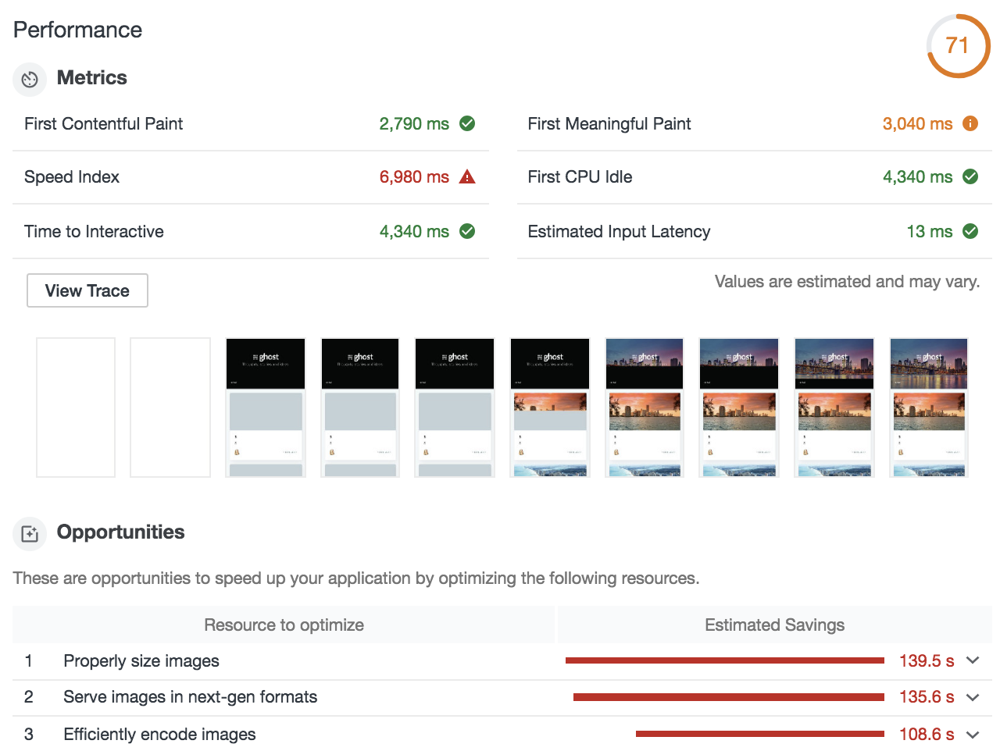
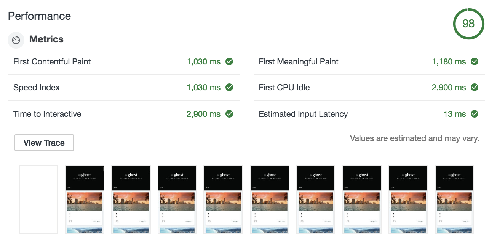
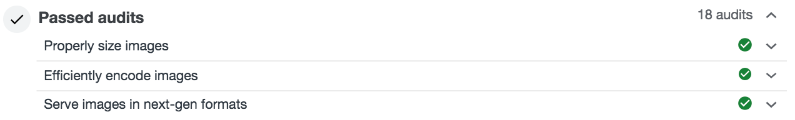

# Ghost accelerator

This application accelerates a Ghost Blog by optimizing assets, and improves Lighthouse scores dramatically. It works out of the box for the default Casper theme and can be easily modified to support other themes.

## Lighthouse
<<<<<<< HEAD
=======

Google Lighthouse measures user perceived application performance, and assigns a score of 0-100 (100 is good, 0 is gross). 

### Before optimizations
>>>>>>> b008fce5391502073a4093638e60d73594633e4c

<<<<<<< HEAD
Google Lighthouse measures user perceived application performance, and assigns a score of 0-100 (100 is good, 0 is gross). 

### Before optimizations

<<<<<<< HEAD

=======
### With optimizations
>>>>>>> b008fce5391502073a4093638e60d73594633e4c

### With optimizations

## What it does

The Casper theme is well designed and loads JavaScript + Style assets intelligently. This app primarily optimizes images:

1. Serves webp when browsers send an `Accept: image/webp` header
2. Resizes images in listings to fit the styles

=======
### With optimizations

>>>>>>> 6c1c356962ea893b89ff970d97d734c93335a449
## What it does

The Casper theme is well designed and loads JavaScript + Style assets intelligently. This app primarily optimizes images:

1. Serves webp when browsers send an `Accept: image/webp` header
2. Resizes images in listings to fit the styles

## Try it yourself

1. First, make sure you have the latest version of Fly installed by running `npm i -g @fly/fly`
2. `git clone https://github.com/superfly/ghost-accelerator.git`
3. `cd ghost-accelerator`
4. `fly server`
5. Visit http://localhost:3000 to view the app

You should see the "demo" version of a Ghost blog (https://demo.ghost.io/)

6. Navigate to the `index.js` file and change `const subdomain` from `"demo"` to your own Ghost Blog's name
7. Save and visit http://localhost:3000 again

You should now see your own Ghost Blog with properly sized, optimized images in the WebP format! Run a Lighthouse audit and see for yourself just how well your blog is performing .. and then, deploy!

8. Run `fly login` (make sure you have a Fly account first, if you don’t, register at https://fly.io/app/sign-up)
9. Run `fly apps create <app-name>` to create a Fly Edge App
10. Then run `fly deploy` to deploy your Fly Edge App
